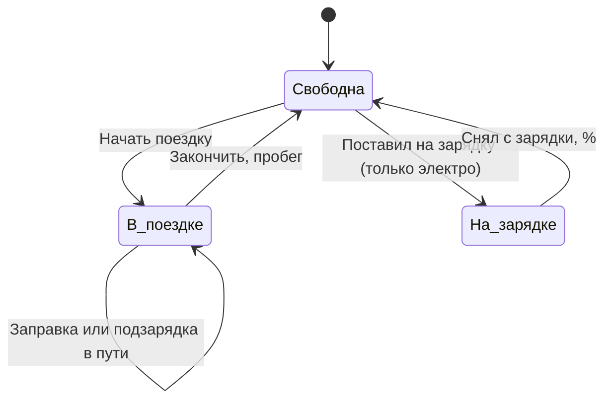

# Учёт машин семьи: требования

Согласовано 9 октября 2026. Рабочая версия ТЗ ведётся в Claude Docs; этот файл — копия для репозитория.

Система ведёт общий журнал всех машин семьи: кто, когда и на какой машине ездил, сколько ушло топлива или заряда, сколько потрачено на машину и во что обходится километр. Данные вносятся короткими отметками в Telegram в момент действия: сел в машину, заправился, вернулся домой, поставил на зарядку.

## Наш кейс

Первая версия делается под одну семью; обобщение на другие семьи — позже.

- **Машины:** 2 — одна дизельная, одна электрическая (Changan Q05, батарея 40,3 кВт·ч, заявленный запас хода 405 км).
- **Водители:** 3, каждый может ездить на любой из машин.
- **Зарядка электро:** дома (~2 кВт) и на станциях 40, 80, 120 кВт.
- **Учёт** нужен для обеих машин; для дизеля — кто водил, пробег и топливо, для электро — пробег, заряд и зарядки.

## Сущности

| Сущность | Что хранит | Связи |
|---|---|---|
| Дом (на будущее — «гараж» или «семья») | Название, участники, настройки цен: свет дома, бензин и дизель, станции | Несколько машин и водителей |
| Машина | Название, тип (дизель или электро), объём бака либо ёмкость батареи, текущий пробег, текущий уровень топлива или заряда, текущее состояние | Принадлежит дому |
| Водитель | Человек в Telegram: имя, аккаунт, роль в доме (владелец или водитель) | Состоит в доме, ездит на любой его машине |

## Журнал событий

Всё, что происходит с машиной, записывается как событие с общей частью — машина, водитель, время, пробег — и данными, зависящими от типа события.

| Событие | Дизель | Электро |
|---|---|---|
| Начал поездку | Пробег; запас хода в км — по желанию | Пробег, % заряда |
| Закончил поездку | Пробег; запас хода в км — по желанию | Пробег, % заряда |
| Заправка | Пробег, литры, цена за литр, сумма (любые два из трёх) | — |
| Начал зарядку | — | Пробег, % заряда, где: дом или станция 40, 80, 120 кВт |
| Закончил зарядку | — | % заряда, кВт·ч, сумма (дома считается по тарифу) |
| Расход | Категория, сумма, кто платил (см. «Прочие расходы») | То же |

Из пар событий система сама собирает **поездки** (старт + финиш) и **зарядки** (начало + конец). Заправка или зарядка может случиться посреди поездки.

## Состояние машины

У каждой машины всегда одно текущее состояние; от него зависит, какие кнопки показывает бот.

Одна машина не может быть одновременно в поездке у двух водителей. Ветка «На зарядке» есть только у электро.

## Сценарии в Telegram-боте

Бот показывает кнопки по текущему состоянию машины, поэтому каждое действие — пара нажатий и одно-два числа.

**Поездка на дизеле с заправкой**

1. Перед запуском: «▶ Начать поездку» → выбрать машину → ввести пробег.
2. В дороге заправился: «⛽ Заправка» → пробег, литры, цена за литр или сумма.
3. Вернулся домой: «🏁 Закончить» → пробег.
4. Бот отвечает итогом: сколько км, расход, во что обошлась поездка.

**Поездка на электро**

1. Перед запуском: «▶ Начать поездку» → выбрать машину → пробег и % заряда.
2. Подзарядка в пути: «🔌 Зарядка» → станция, % до; по окончании — % после, кВт·ч, сумма.
3. Вернулся домой: «🏁 Закончить» → пробег и % заряда.

**Зарядка электро дома**

1. Поставил на зарядку: «🔌 Начать зарядку» → «Дома» → % заряда.
2. Снял с зарядки: «Закончить зарядку» → % заряда. Стоимость бот считает сам по тарифу.

**Прочий расход**

1. «💳 Расход» → машина → категория → сумма, по желанию фото чека.

В любой момент: «Где машины?» — кто на какой машине, что на зарядке, что свободно.

## Контроль и проверки

- **Забыли закончить поездку** — бот напоминает, если поездка открыта дольше N часов (N задаётся в настройках).
- **Неучтённый пробег** — если пробег при старте больше, чем при прошлом финише, появляются «неучтённые 15 км»; их нужно приписать водителю.
- **Пробег не уменьшается**, заряд и топливо — от 0 до 100 %.
- **Машина занята** — нельзя начать поездку на машине, которая уже в пути у другого водителя.
- **Задним числом** — запись можно добавить позже; такие записи помечаются.

## Дополнительно

- **Сравнение машин:** сколько стоит 1 км на дизеле и на электро — по топливу и полностью, с прочими расходами.
- **Фото чека или приборной панели** — по желанию, как подтверждение к записи.
- **Температура на улице** подтягивается автоматически по погоде. Нужна для зимней статистики электро.

## Прочие расходы

Событие «Расход»: машина, кто платил, дата, категория, сумма, комментарий, по желанию фото чека и пробег.

| Категория | Что входит | Как учитывать |
|---|---|---|
| Обслуживание | ТО, масло и фильтры, ремонт, запчасти | Разово |
| Шины | Покупка, сезонная переобувка, хранение | Покупка — на несколько сезонов, переобувка — разово |
| Уход | Мойка, химчистка, аксессуары и покупки для машины | Разово |
| Документы | Страховка, техосмотр, налог, регистрация | На срок действия (обычно год) |
| Дорога | Парковка, платные дороги | Разово |
| Штрафы | С отметкой, кто нарушил | Разово |

Список категорий можно пополнять самим. Распределённые расходы (страховка, шины) размазываются по месяцам срока.

Напоминания по датам и пробегу: «страховка кончается через 2 недели», «до ТО осталось 800 км», «пора переобуваться».

## Отчёты

| Отчёт | Что показывает |
|---|---|
| По машине | Пробег; расход топлива (л/100 км) или энергии (кВт·ч/100 км); затраты на топливо или зарядку; полная стоимость владения в сомах за месяц и за 1 км; структура расходов |
| Дизель против электро | Стоимость 1 км по топливу и полная; сколько сэкономила электричка |
| По водителям | Кто сколько проехал, на какой машине, сколько поездок; во сколько обошлись его поездки; кто сколько заплатил из своего кармана |
| Электро отдельно | Расход по месяцам и от температуры; зарядки дома и на станциях, средняя цена кВт·ч; запас хода сейчас и прогноз на зиму |
| Журнал | Лента событий с фильтрами; неучтённый пробег и незакрытые поездки |

Периоды: неделя, месяц, год, произвольный. Выгрузка в Excel.

## Принятые решения

- **Топливо дизеля** — расход считается по заправкам за период: сумма залитых литров / км за тот же период; заправляться можно как угодно. Стоимость поездки = км × средний расход машины × цена литра (пока заправок мало — заводской расход). На старте и финише вводится только пробег; запас хода в км — по желанию, как справка.
- **«Текущий курс» при заправке** — цена за литр. Вводятся любые два значения из трёх (литры, цена за литр, сумма), третье считается.
- **Домашняя зарядка** — стоимость по тарифу: кВт·ч × цена из настроек. Домашний счётчик и лимит 700 кВт·ч — во второй версии.
- **Взаиморасчёты** — в первой версии: кто сколько наездил в сомах и кто сколько заплатил. «Кто кому должен» — позже.
- **Строгость записи** — записи задним числом разрешены, но помечаются; пропуски в пробеге подсвечиваются.

## Первая версия и что потом

| Область | Первая версия | Потом |
|---|---|---|
| Дом и участники | Один дом, 2 машины, 3 водителя, роли владелец и водитель | Несколько домов, приглашения для других семей |
| События | Старт и финиш поездки, заправка, зарядка, прочий расход | Фото чека и приборной панели |
| Состояние машин | Кто на какой машине, что на зарядке, запрет двойного старта | — |
| Контроль | Напоминание о незакрытой поездке, неучтённый пробег, проверки ввода, пометка «задним числом» | — |
| Прочие расходы | Категории, разовые и распределённые на срок | Напоминания по датам и пробегу |
| Отчёты | По машине, по водителям, дизель против электро, журнал; периоды | Выгрузка в Excel, Telegram Mini App с графиками |
| Деньги | Кто сколько наездил в сомах и кто сколько заплатил | «Кто кому должен» |
| Электро | Расход по месяцам, зарядки, запас хода сейчас и зимой, температура по погоде | Домашний счётчик и лимит 700 кВт·ч |
